# LLUMINARY ARCHITECTURE

## Overview

This document provides a comprehensive visual overview of the LLuMinary package's architecture, including component relationships, data flow, and key design patterns. Use this as a reference for understanding the high-level system design and component interactions.

## Table of Contents

- [Overview](#overview)
- [High-Level Architecture](#high-level-architecture)
- [Directory Structure](#directory-structure)
- [Provider Registry Pattern](#provider-registry-pattern)
- [Message Flow](#message-flow)
- [Component Relationships](#component-relationships)
- [Embedding Architecture](#embedding-architecture)
- [Reranking Architecture](#reranking-architecture)
- [Streaming Architecture](#streaming-architecture)
- [Tool Handling Architecture](#tool-handling-architecture)
- [Error Handling Architecture](#error-handling-architecture)
- [Classification Architecture](#classification-architecture)

## Overview

The LLuMinary package provides a unified interface for interacting with multiple LLM providers, including OpenAI, Anthropic, Google, Cohere, and AWS Bedrock. It abstracts away provider-specific implementation details while exposing a consistent API for common operations like text generation, streaming, embeddings, function calling, and document reranking.

## High-Level Architecture

This diagram illustrates the high-level architecture of the LLuMinary package, showing the main components and their relationships:

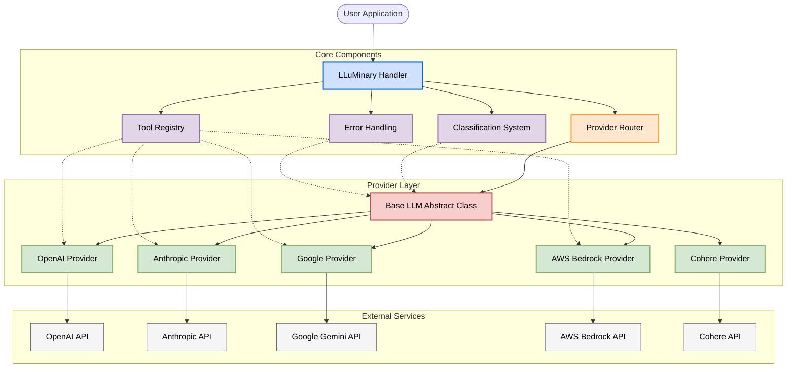

## Directory Structure

The LLuMinary package follows this directory structure:

```
src/lluminary/
├── cli/                   # Command-line interface tools
│   └── classify.py        # Classification command-line tools
├── exceptions.py          # Centralized error hierarchy
├── handler.py             # Main LLuMinary interface class
├── models/                # Core LLM model implementations
│   ├── base.py            # Abstract base class for all LLM implementations
│   ├── classification/    # Classification system components
│   │   ├── classifier.py  # Main classification implementation
│   │   ├── config.py      # Classification configuration management
│   │   └── validators.py  # XML response validators
│   ├── providers/         # LLM provider-specific implementations
│   │   ├── anthropic.py   # Anthropic Claude implementation
│   │   ├── openai.py      # OpenAI implementation
│   │   ├── google.py      # Google Gemini implementation
│   │   ├── bedrock.py     # AWS Bedrock implementation
│   │   ├── cohere.py      # Cohere implementation
│   │   └── provider_template.py # Template for new providers
│   └── router.py          # Model routing and registry
├── prompts/               # System prompts and templates
│   └── classification/    # Classification-specific prompts
│       └── base.yaml      # Base classification prompt template
├── py.typed               # Marker file for PEP 561 typing support
├── tools/                 # Function calling and tool implementations
│   ├── registry.py        # Tool registration system
│   └── validators.py      # Tool input/output validators
├── utils/                 # Shared utility functions
│   └── aws.py             # AWS utilities (authentication, etc.)
└── version.py             # Package version information
```

This structure follows modern Python package organization with clear separation of concerns:

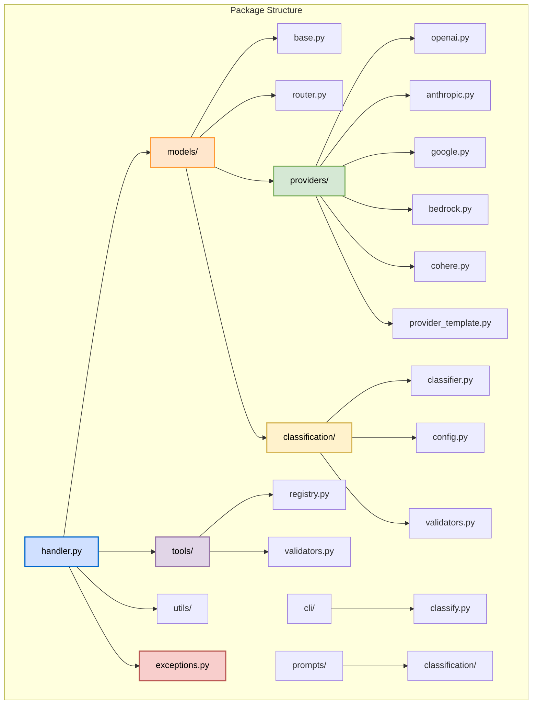

Key design principles in this structure:
1. Clear separation of concerns between components
2. Provider-agnostic base interfaces
3. Shared utilities at the package level
4. Modular organization for extensibility

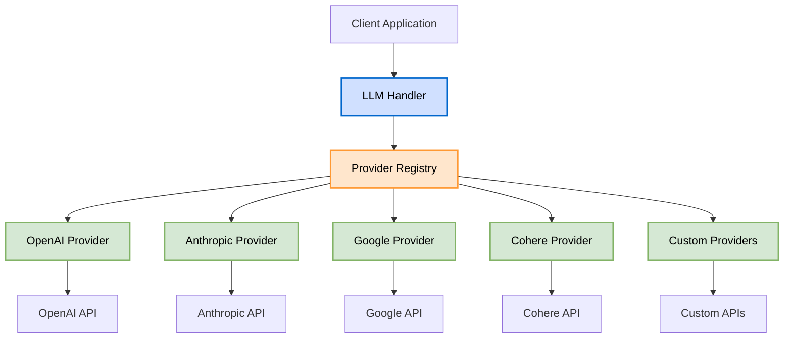

## Provider Registry Pattern

The library uses a registry pattern to dynamically register and manage LLM providers. This enables extensibility by allowing new providers to be added without modifying existing code.

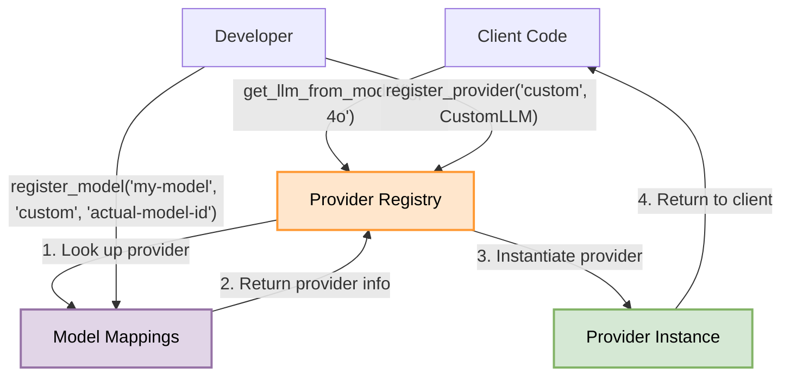

## Message Flow

This diagram illustrates how messages flow through the system, from user input to provider-specific formats and back.

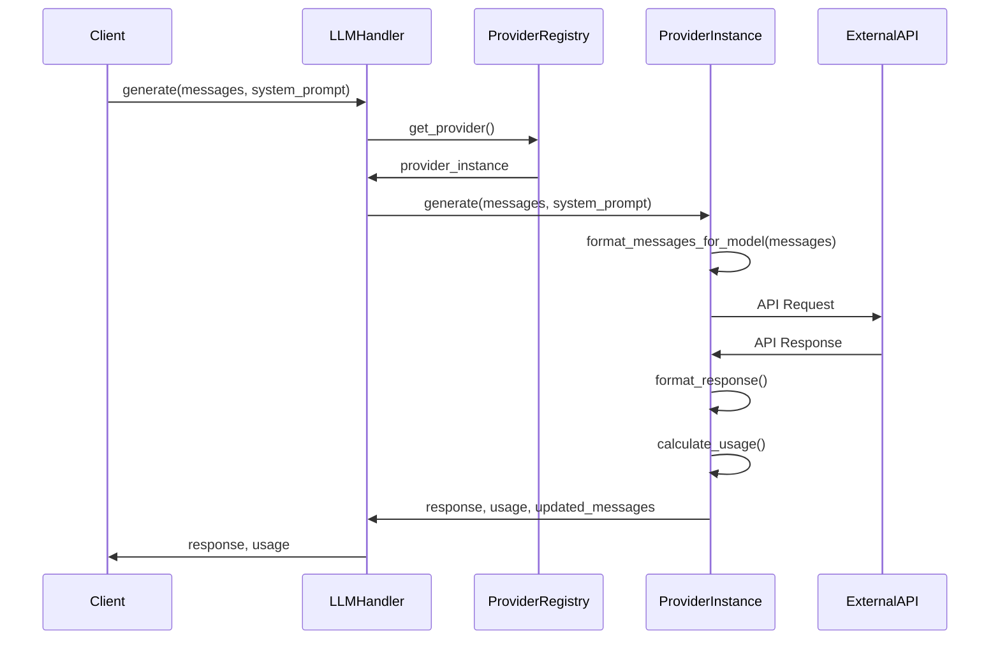

## Component Relationships

The following diagram shows the relationships between major components of the library.

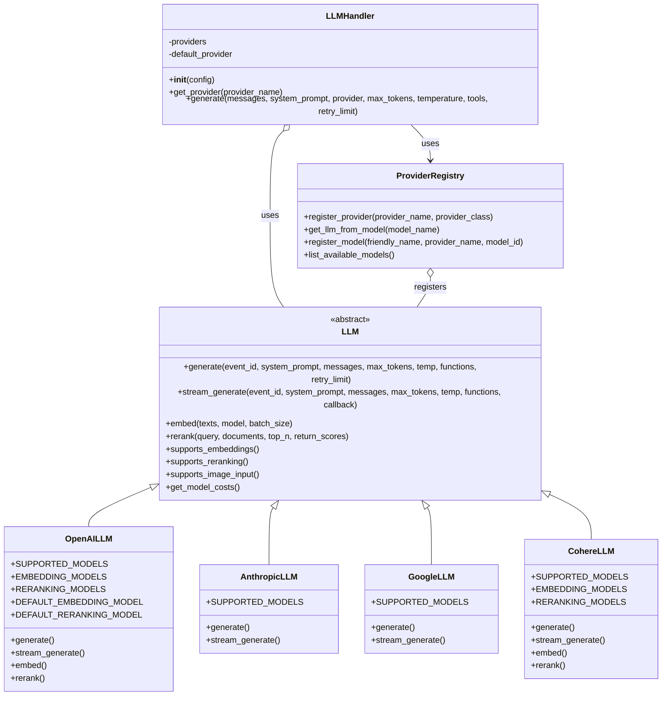

## Embedding Architecture

This diagram illustrates the embedding functionality workflow.

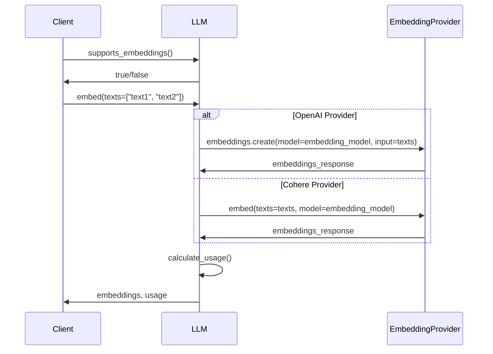

## Reranking Architecture

This diagram shows the document reranking workflow.

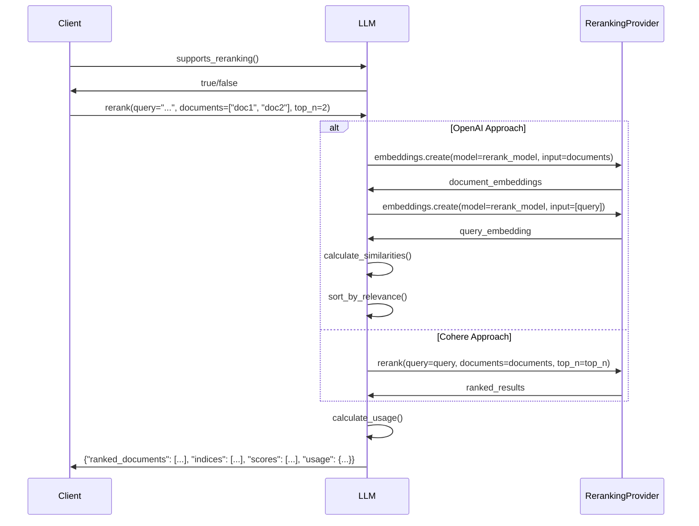

## Streaming Architecture

This diagram illustrates the streaming response workflow.

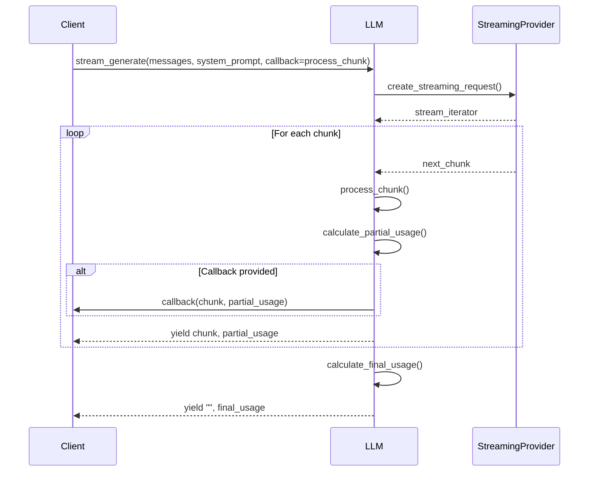

## Tool Handling Architecture

The tool handling system enables function calling and tool use with LLMs. This architecture supports a consistent interface across providers with different native function calling capabilities.

```mermaid
graph TD
    Client[Client Application] -->|"function_call(tools=[...])"| LLuMinary

    subgraph LLuMinary Package
        LLuMinary[LLuMinary Handler] -->|verify_tools| Registry[Tool Registry]
        Registry -->|validate_schema| Validators[Tool Validators]

        LLuMinary -->|"generate(..., functions=tools)"| Provider[Provider Instance]

        subgraph "Provider-Specific Handling"
            Provider -->|supports_native_tools?| Decision{Native Tools Support?}

            Decision -->|Yes| NativeFormat[Format for Native Function Calling]
            Decision -->|No| PromptFormat[Format as Prompt Instructions]

            NativeFormat --> APICall[Provider API with Functions]
            PromptFormat --> APICall2[Provider API without Functions]
        end

        APICall --> ResponseParser[Parse Function Call Response]
        APICall2 --> TextParser[Parse Text for Function Calls]

        ResponseParser --> Client
        TextParser --> Client
    end

    style LLuMinary fill:#d0e0ff,stroke:#0066cc,stroke-width:2px,color:#000000
    style Registry fill:#e1d5e7,stroke:#9673a6,stroke-width:2px,color:#000000
    style Validators fill:#e1d5e7,stroke:#9673a6,stroke-width:2px,color:#000000
    style Decision fill:#ffe6cc,stroke:#ff9933,stroke-width:2px,color:#000000
    style Provider fill:#d5e8d4,stroke:#82b366,stroke-width:2px,color:#000000
    style NativeFormat,PromptFormat fill:#fff2cc,stroke:#d6b656,stroke-width:1px,color:#000000
```

### Tool Registration Flow

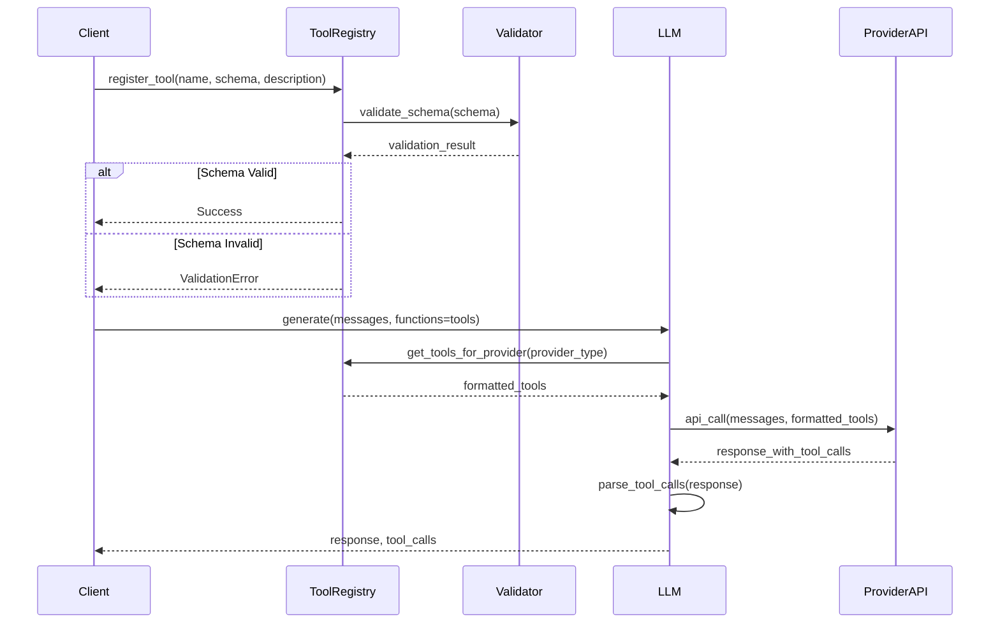

## Error Handling Architecture

The LLuMinary package implements a robust error handling system with a unified exception hierarchy and provider-specific error mapping.

```mermaid
graph TD
    subgraph Error Hierarchy
        BaseError[LLMError] --> RateLimit[LLMRateLimitError]
        BaseError --> Timeout[LLMTimeoutError]
        BaseError --> Connection[LLMConnectionError]
        BaseError --> Auth[LLMAuthenticationError]
        BaseError --> Validation[LLMValidationError]
        BaseError --> ModelError[LLMMistake]
    end

    subgraph Provider Specific
        OpenAIError[OpenAI Exceptions] --> ErrorMapper1[Error Mapper]
        AnthropicError[Anthropic Exceptions] --> ErrorMapper2[Error Mapper]
        GoogleError[Google Exceptions] --> ErrorMapper3[Error Mapper]
        CohereError[Cohere Exceptions] --> ErrorMapper4[Error Mapper]
        BedrockError[AWS Exceptions] --> ErrorMapper5[Error Mapper]
    end

    ErrorMapper1 --> BaseError
    ErrorMapper2 --> BaseError
    ErrorMapper3 --> BaseError
    ErrorMapper4 --> BaseError
    ErrorMapper5 --> BaseError

    Application[User Application] --> TryCatch[Try/Catch Block]
    TryCatch --> BaseError

    style BaseError fill:#f8cecc,stroke:#b85450,stroke-width:2px,color:#000000
    style RateLimit,Timeout,Connection,Auth,Validation,ModelError fill:#f8cecc,stroke:#b85450,stroke-width:1px,color:#000000
    style OpenAIError,AnthropicError,GoogleError,CohereError,BedrockError fill:#d5e8d4,stroke:#82b366,stroke-width:1px,color:#000000
    style ErrorMapper1,ErrorMapper2,ErrorMapper3,ErrorMapper4,ErrorMapper5 fill:#fff2cc,stroke:#d6b656,stroke-width:1px,color:#000000
```

### Error Handling Flow

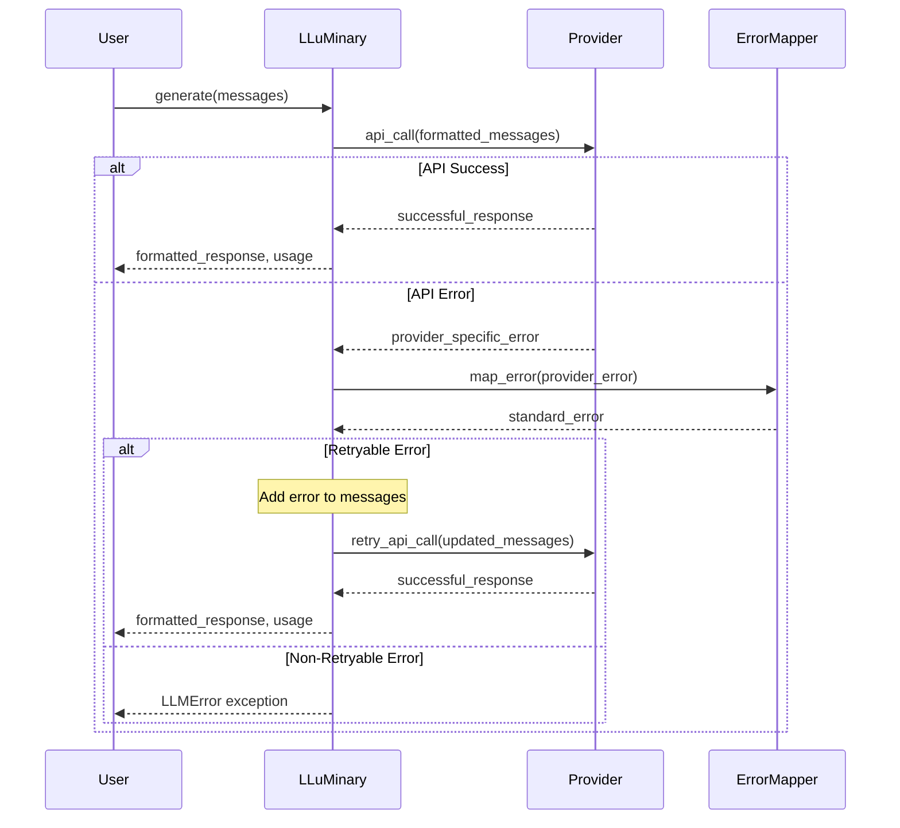

## Classification Architecture

The classification system provides a consistent way to categorize text across all providers.

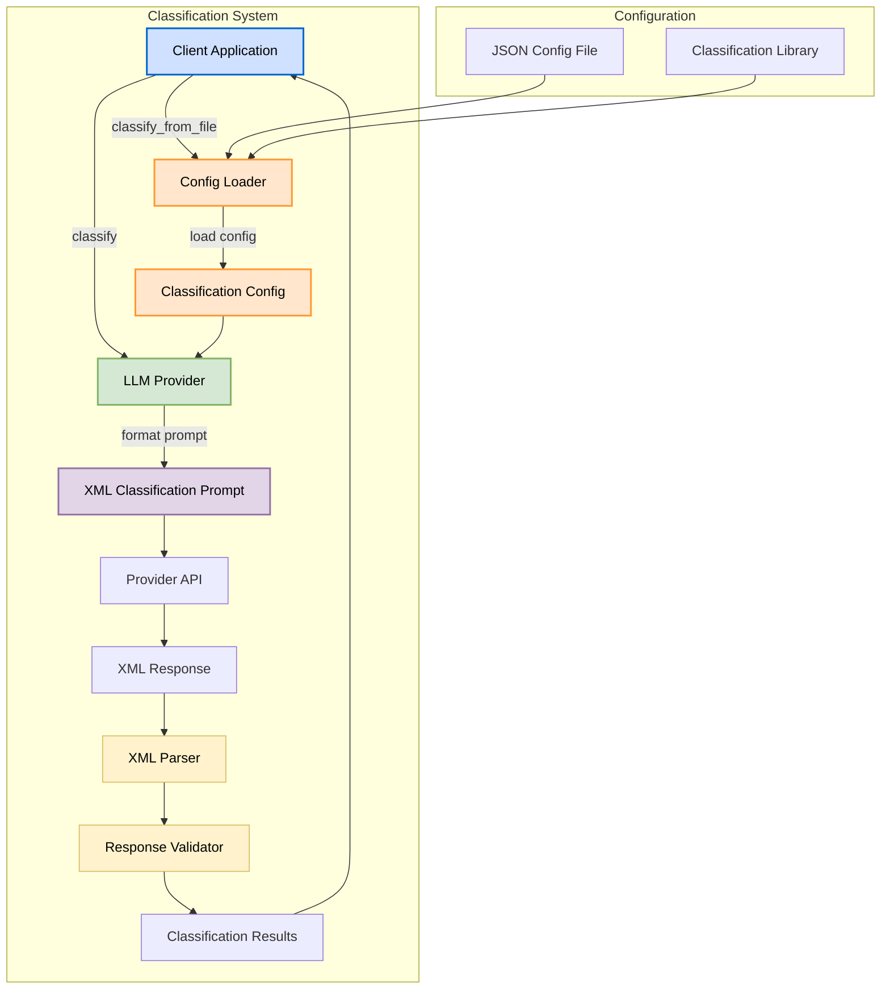

### Classification Flow

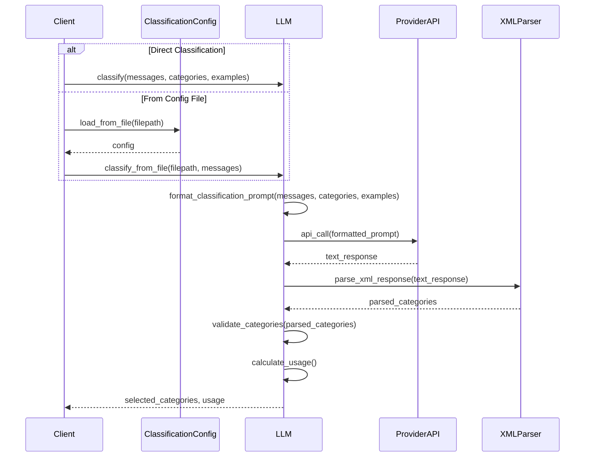

## Related Documentation

- [API_REFERENCE](./API_REFERENCE.md) - Detailed API reference for all components
- [TUTORIALS](./TUTORIALS.md) - Step-by-step guides for common use cases
- [ERROR_HANDLING](./development/ERROR_HANDLING.md) - Details on the error handling system
- [PROVIDER_TESTING](./development/PROVIDER_TESTING.md) - Information on provider implementation testing
- [MODELS](./development/MODELS.md) - Comprehensive list of supported models
