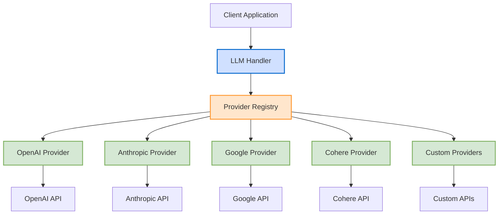
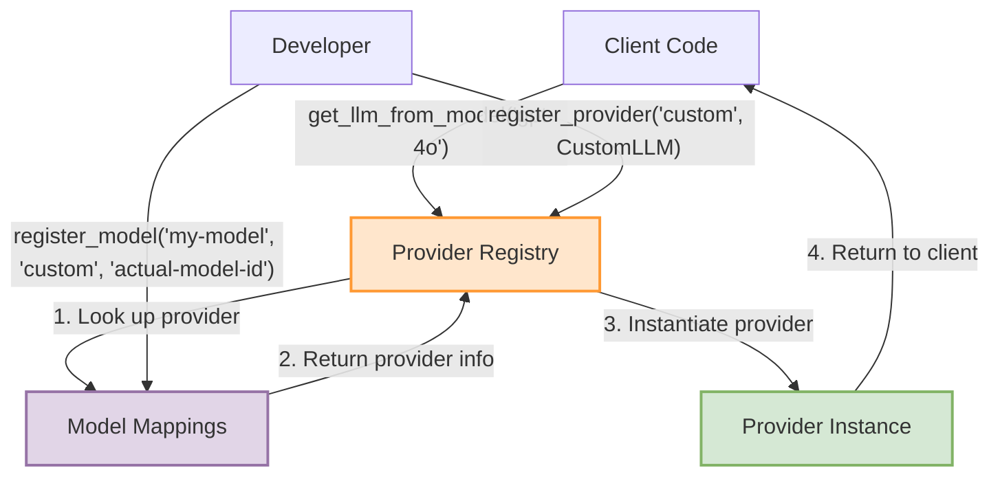
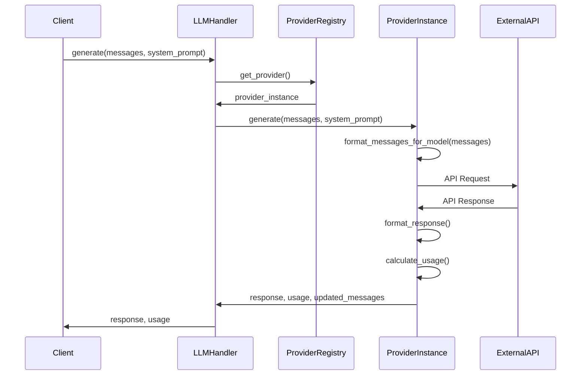
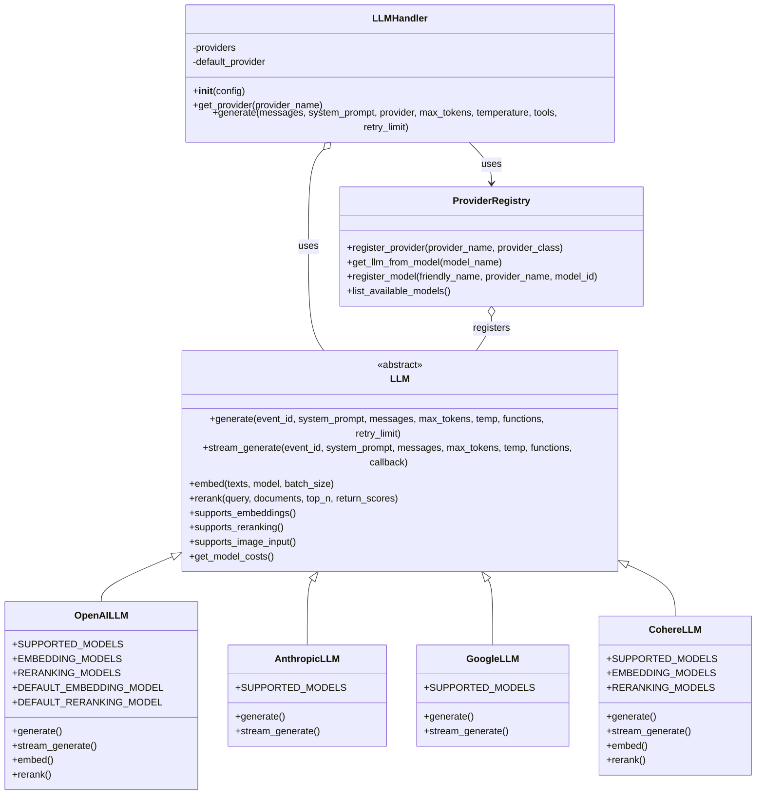
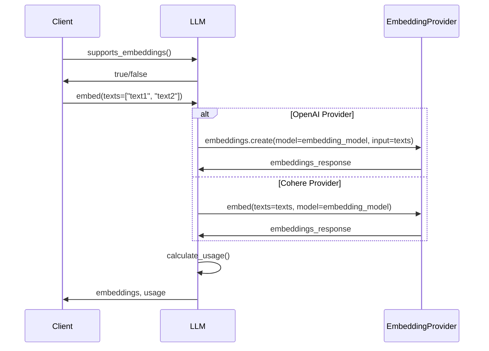
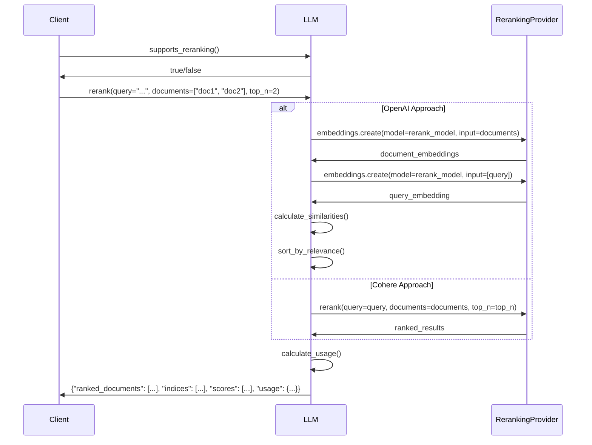
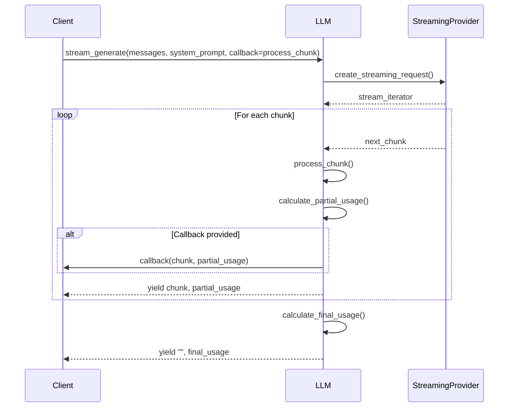

# LLM Handler Architecture

This document provides a visual overview of the LLM Handler library's architecture, including component relationships, data flow, and key design patterns.

## Table of Contents

- [Overview](#overview)
- [Directory Structure](#directory-structure)
- [Provider Registry Pattern](#provider-registry-pattern)
- [Message Flow](#message-flow)
- [Component Relationships](#component-relationships)
- [Embedding Architecture](#embedding-architecture)
- [Reranking Architecture](#reranking-architecture)
- [Streaming Architecture](#streaming-architecture)

## Overview

The LLM Handler library provides a unified interface for interacting with multiple LLM providers, including OpenAI, Anthropic, Google, and Cohere. It abstracts away provider-specific implementation details while exposing a consistent API for common operations like text generation, streaming, embeddings, and document reranking.

## Directory Structure

The LLM Handler package follows this directory structure:

```
src/llmhandler/
├── cli/                   # Command-line interface tools
│   └── classify.py        # Classification command-line tools
├── models/                # Core LLM model implementations
│   ├── base.py            # Abstract base class for all LLM implementations
│   ├── classification/    # Classification system components
│   │   ├── classifier.py  # Main classification implementation
│   │   ├── config.py      # Classification configuration management
│   │   └── validators.py  # XML response validators
│   ├── providers/         # LLM provider-specific implementations
│   │   ├── anthropic.py   # Anthropic Claude implementation
│   │   ├── openai.py      # OpenAI implementation
│   │   ├── google.py      # Google Gemini implementation
│   │   └── ...            # Other providers
│   └── router.py          # Model routing and registry
├── prompts/               # System prompts and templates
│   └── classification/    # Classification-specific prompts
│       └── base.yaml      # Base classification prompt template
├── tools/                 # Function calling and tool implementations
│   ├── registry.py        # Tool registration system
│   └── validators.py      # Tool input/output validators
└── utils/                 # Shared utility functions
    └── aws.py             # AWS utilities (authentication, etc.)
```

Key design principles in this structure:
1. Clear separation of concerns between components
2. Provider-agnostic base interfaces
3. Shared utilities at the package level
4. Modular organization for extensibility


```mermaid
graph TD
    Client[Client Application] --> LLMHandler[LLM Handler]
    LLMHandler --> Registry[Provider Registry]
    Registry --> OpenAI[OpenAI Provider]
    Registry --> Anthropic[Anthropic Provider]
    Registry --> Google[Google Provider]
    Registry --> Cohere[Cohere Provider]
    Registry --> Custom[Custom Providers]

    OpenAI --> OpenAIAPI[OpenAI API]
    Anthropic --> AnthropicAPI[Anthropic API]
    Google --> GoogleAPI[Google API]
    Cohere --> CohereAPI[Cohere API]
    Custom --> CustomAPI[Custom APIs]

    style LLMHandler fill:#d0e0ff,stroke:#0066cc,stroke-width:2px
    style Registry fill:#ffe6cc,stroke:#ff9933,stroke-width:2px
    style OpenAI fill:#d5e8d4,stroke:#82b366,stroke-width:2px
    style Anthropic fill:#d5e8d4,stroke:#82b366,stroke-width:2px
    style Google fill:#d5e8d4,stroke:#82b366,stroke-width:2px
    style Cohere fill:#d5e8d4,stroke:#82b366,stroke-width:2px
    style Custom fill:#d5e8d4,stroke:#82b366,stroke-width:2px
```

## Provider Registry Pattern

The library uses a registry pattern to dynamically register and manage LLM providers. This enables extensibility by allowing new providers to be added without modifying existing code.


```mermaid
graph TD
    Client[Client Code] -->|"get_llm_from_model('gpt-4o')"| Registry[Provider Registry]
    Registry -->|1. Look up provider| ModelMap[Model Mappings]
    ModelMap -->|2. Return provider info| Registry
    Registry -->|3. Instantiate provider| Provider[Provider Instance]
    Provider -->|4. Return to client| Client

    Developer[Developer] -->|"register_provider('custom', CustomLLM)"| Registry
    Developer -->|"register_model('my-model', 'custom', 'actual-model-id')"| ModelMap

    style Registry fill:#ffe6cc,stroke:#ff9933,stroke-width:2px
    style ModelMap fill:#e1d5e7,stroke:#9673a6,stroke-width:2px
    style Provider fill:#d5e8d4,stroke:#82b366,stroke-width:2px
```

## Message Flow

This diagram illustrates how messages flow through the system, from user input to provider-specific formats and back.


```mermaid
sequenceDiagram
    participant Client
    participant LLMHandler
    participant ProviderRegistry
    participant ProviderInstance
    participant ExternalAPI

    Client->>LLMHandler: generate(messages, system_prompt)
    LLMHandler->>ProviderRegistry: get_provider()
    ProviderRegistry->>LLMHandler: provider_instance
    LLMHandler->>ProviderInstance: generate(messages, system_prompt)
    ProviderInstance->>ProviderInstance: format_messages_for_model(messages)
    ProviderInstance->>ExternalAPI: API Request
    ExternalAPI->>ProviderInstance: API Response
    ProviderInstance->>ProviderInstance: format_response()
    ProviderInstance->>ProviderInstance: calculate_usage()
    ProviderInstance->>LLMHandler: response, usage, updated_messages
    LLMHandler->>Client: response, usage
```

## Component Relationships

The following diagram shows the relationships between major components of the library.


```mermaid
classDiagram
    class LLM {
        <<abstract>>
        +generate(event_id, system_prompt, messages, max_tokens, temp, functions, retry_limit)
        +stream_generate(event_id, system_prompt, messages, max_tokens, temp, functions, callback)
        +embed(texts, model, batch_size)
        +rerank(query, documents, top_n, return_scores)
        +supports_embeddings()
        +supports_reranking()
        +supports_image_input()
        +get_model_costs()
    }

    class OpenAILLM {
        +SUPPORTED_MODELS
        +EMBEDDING_MODELS
        +RERANKING_MODELS
        +DEFAULT_EMBEDDING_MODEL
        +DEFAULT_RERANKING_MODEL
        +generate()
        +stream_generate()
        +embed()
        +rerank()
    }

    class AnthropicLLM {
        +SUPPORTED_MODELS
        +generate()
        +stream_generate()
    }

    class GoogleLLM {
        +SUPPORTED_MODELS
        +generate()
        +stream_generate()
    }

    class CohereLLM {
        +SUPPORTED_MODELS
        +EMBEDDING_MODELS
        +RERANKING_MODELS
        +generate()
        +stream_generate()
        +embed()
        +rerank()
    }

    class LLMHandler {
        -providers
        -default_provider
        +__init__(config)
        +get_provider(provider_name)
        +generate(messages, system_prompt, provider, max_tokens, temperature, tools, retry_limit)
    }

    class ProviderRegistry {
        +register_provider(provider_name, provider_class)
        +get_llm_from_model(model_name)
        +register_model(friendly_name, provider_name, model_id)
        +list_available_models()
    }

    LLM <|-- OpenAILLM
    LLM <|-- AnthropicLLM
    LLM <|-- GoogleLLM
    LLM <|-- CohereLLM

    LLMHandler o-- LLM : uses
    ProviderRegistry o-- LLM : registers
    LLMHandler --> ProviderRegistry : uses
```

## Embedding Architecture

This diagram illustrates the embedding functionality workflow.


```mermaid
sequenceDiagram
    participant Client
    participant LLM
    participant EmbeddingProvider

    Client->>LLM: supports_embeddings()
    LLM->>Client: true/false

    Client->>LLM: embed(texts=["text1", "text2"])

    alt OpenAI Provider
        LLM->>EmbeddingProvider: embeddings.create(model=embedding_model, input=texts)
        EmbeddingProvider->>LLM: embeddings_response
    else Cohere Provider
        LLM->>EmbeddingProvider: embed(texts=texts, model=embedding_model)
        EmbeddingProvider->>LLM: embeddings_response
    end

    LLM->>LLM: calculate_usage()
    LLM->>Client: embeddings, usage
```

## Reranking Architecture

This diagram shows the document reranking workflow.


```mermaid
sequenceDiagram
    participant Client
    participant LLM
    participant RerankingProvider

    Client->>LLM: supports_reranking()
    LLM->>Client: true/false

    Client->>LLM: rerank(query="...", documents=["doc1", "doc2"], top_n=2)

    alt OpenAI Approach
        LLM->>RerankingProvider: embeddings.create(model=rerank_model, input=documents)
        RerankingProvider->>LLM: document_embeddings
        LLM->>RerankingProvider: embeddings.create(model=rerank_model, input=[query])
        RerankingProvider->>LLM: query_embedding
        LLM->>LLM: calculate_similarities()
        LLM->>LLM: sort_by_relevance()
    else Cohere Approach
        LLM->>RerankingProvider: rerank(query=query, documents=documents, top_n=top_n)
        RerankingProvider->>LLM: ranked_results
    end

    LLM->>LLM: calculate_usage()
    LLM->>Client: {"ranked_documents": [...], "indices": [...], "scores": [...], "usage": {...}}
```

## Streaming Architecture

This diagram illustrates the streaming response workflow.


```mermaid
sequenceDiagram
    participant Client
    participant LLM
    participant StreamingProvider

    Client->>LLM: stream_generate(messages, system_prompt, callback=process_chunk)

    LLM->>StreamingProvider: create_streaming_request()
    StreamingProvider-->>LLM: stream_iterator

    loop For each chunk
        StreamingProvider-->>LLM: next_chunk
        LLM->>LLM: process_chunk()
        LLM->>LLM: calculate_partial_usage()

        alt Callback provided
            LLM->>Client: callback(chunk, partial_usage)
        end

        LLM-->>Client: yield chunk, partial_usage
    end

    LLM->>LLM: calculate_final_usage()
    LLM-->>Client: yield "", final_usage
```
