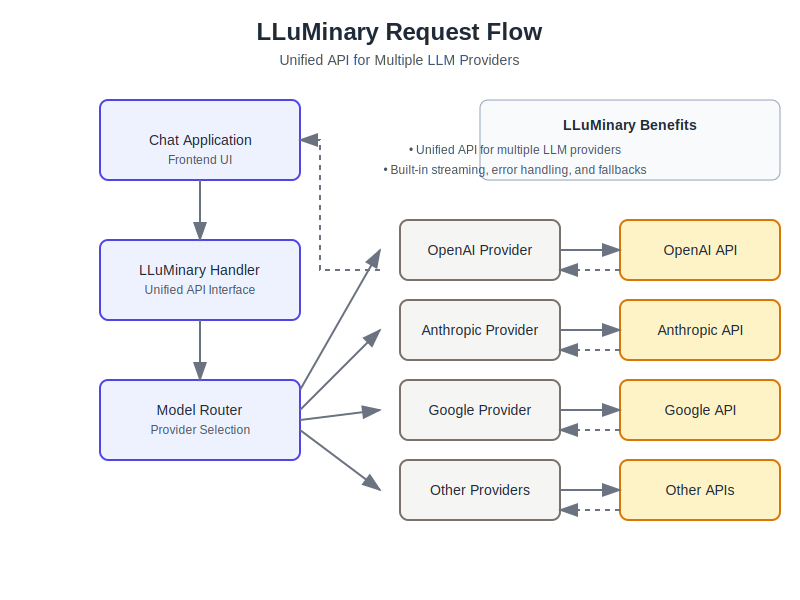

# LLuMinary Chat Demo

A modern React/Tailwind-based chat application that demonstrates the capabilities of LLuMinary - a unified API library for multiple LLM providers.


## Features

- 🤖 Support for multiple LLM providers:
  - OpenAI (GPT-4o, GPT-4, etc.)
  - Anthropic (Claude models)
  - Google (Gemini models)
  - Cohere (Command models)
  - AWS Bedrock
- 🔄 Real-time streaming responses
- 📷 Image input support (for multimodal models)
- 🛠️ Function calling capabilities
- 📊 Token usage and cost tracking
- 🧩 Model selection interface
- 📝 Markdown rendering with syntax highlighting
- 📱 Responsive design for desktop and mobile

## How It Works

This demo application showcases how to integrate LLuMinary into a web application to provide a unified interface to multiple LLM providers.

### Architecture

```
┌─────────────────┐      ┌─────────────────┐      ┌─────────────────┐
│                 │      │                 │      │    LLM APIs     │
│  React Frontend │◄────►│ Python Backend  │◄────►│  (OpenAI, etc.) │
│                 │      │  with LLuMinary │      │                 │
└─────────────────┘      └─────────────────┘      └─────────────────┘
```

### LLuMinary Integration

The React frontend communicates with a Flask backend that uses LLuMinary to handle:

1. Provider authentication
2. Model selection
3. Text generation
4. Streaming responses
5. Token counting and cost tracking

The backend translates the app's requests into the appropriate LLuMinary calls, which then handles the specifics of communicating with each LLM provider's API.

## LLuMinary Flow Diagram



### How LLuMinary is Used in the Chat Application

When a user sends a message in the chat interface:

1. The UI dispatches the message to the backend API
2. The backend uses LLuMinary to:
   - Select the appropriate provider based on the model
   - Format the messages according to the provider's requirements
   - Handle authentication with the provider's API
   - Make the API request to generate a completion
   - Process and return the response
3. For streaming responses, LLuMinary's `stream_generate` method is used to provide real-time chunks
4. Token counts and cost estimates are captured from LLuMinary's usage data

LLuMinary abstracts away the differences between provider APIs, allowing the application to use a consistent interface regardless of which LLM provider is selected.

## Getting Started

### Prerequisites

- Python 3.8+ with pip
- Node.js 14+ with npm
- API keys for the LLM providers you want to use

### Installation

1. Clone the repository:
   ```
   git clone https://github.com/yourusername/lluminary-chat-demo.git
   cd lluminary-chat-demo
   ```

2. Install the Python dependencies:
   ```
   pip install -r requirements.txt
   ```

3. Install the frontend dependencies:
   ```
   npm install
   ```

### Running the Application

1. Start the backend server:
   ```
   python server.py
   ```

2. Start the frontend development server:
   ```
   npm start
   ```

3. Open your browser and navigate to `http://localhost:3000`

4. Configure your API keys in the settings panel

## Configuration

You'll need to configure API keys for the LLM providers you want to use:

- OpenAI: `OPENAI_API_KEY`
- Anthropic: `ANTHROPIC_API_KEY`
- Google: `GOOGLE_API_KEY`
- Cohere: `COHERE_API_KEY`
- AWS Bedrock: AWS profile name with appropriate permissions

## Code Structure

### Frontend (React/TypeScript)

- `/src/components` - React components
- `/src/hooks` - Custom React hooks
- `/src/services` - API service for backend communication
- `/src/store` - Redux store and slices
- `/src/types` - TypeScript type definitions
- `/src/utils` - Utility functions

### Backend (Python/Flask)

- `server.py` - Flask server with API endpoints
- Uses LLuMinary for LLM provider integration

## Key Technical Decisions

1. **Redux for State Management**: Provides a centralized store for chat history, settings, and provider configuration.

2. **TypeScript**: Adds type safety and improves development experience with better tooling.

3. **Tailwind CSS**: Allows for rapid UI development with utility classes.

4. **Flask Backend**: Lightweight Python server that integrates easily with LLuMinary.

5. **SSE for Streaming**: Server-Sent Events provide real-time streaming of LLM responses.

## LLuMinary Key Concepts Demonstrated

1. **Unified API**: The application uses the same interface regardless of the LLM provider.

2. **Provider Registry**: Models are automatically routed to the appropriate provider.

3. **Streaming Support**: Real-time response chunks for a better user experience.

4. **Usage Tracking**: Token counts and cost estimates are tracked and displayed.

5. **Model Capabilities**: The UI adapts based on the capabilities of the selected model.

## Extending the Application

You can extend this demo in several ways:

1. Add support for more LLuMinary features:
   - Embeddings for semantic search
   - Reranking for search results
   - Classification for categorizing messages

2. Implement additional chat features:
   - Chat history persistence
   - Multi-user support
   - File attachments and document processing

3. Enhance the UI:
   - Dark mode
   - Customizable themes
   - More visualization options

## License

This project is licensed under the MIT License - see the LICENSE file for details.

## Acknowledgments

- LLuMinary for providing the unified LLM API
- OpenAI, Anthropic, Google, Cohere, and AWS for their LLM APIs
