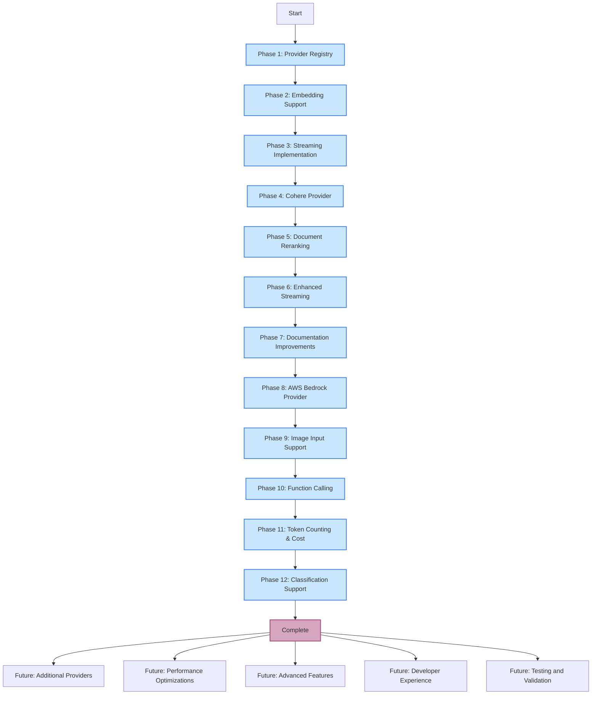

# LLM Handler Project Implementation Plan

## 1. Executive Summary

After thoroughly reviewing the codebase, I've consolidated the implementation plan for the LLM Handler library. This document provides a comprehensive overview of completed work, current status, and future recommendations for the library's development.

The LLM Handler library provides a unified interface for interacting with various LLM providers (OpenAI, Anthropic, Google, Cohere, and AWS Bedrock) with features for text generation, embeddings, streaming, document reranking, and more.

## 2. Current Implementation Status

| Component                | Implementation | Testing | Documentation | Review |
|--------------------------|----------------|---------|---------------|--------|
| Provider Registry Pattern | ✅ COMPLETE    | ✅ COMPLETE | ✅ COMPLETE | ✅ COMPLETE |
| Embedding Support        | ✅ COMPLETE    | ✅ COMPLETE | ✅ COMPLETE | ✅ COMPLETE |
| Streaming Implementation | ✅ COMPLETE    | ✅ COMPLETE | ✅ COMPLETE | ✅ COMPLETE |
| Cohere Provider          | ✅ COMPLETE    | ✅ COMPLETE | ✅ COMPLETE | ✅ COMPLETE |
| Document Reranking       | ✅ COMPLETE    | ✅ COMPLETE | ✅ COMPLETE | ✅ COMPLETE |
| Enhanced Streaming       | ✅ COMPLETE    | ✅ COMPLETE | ✅ COMPLETE | ✅ COMPLETE |
| Improved Documentation   | ✅ COMPLETE    | ✅ COMPLETE | ✅ COMPLETE | ✅ COMPLETE |
| AWS Bedrock Provider     | ✅ COMPLETE    | ✅ COMPLETE | ✅ COMPLETE | ✅ COMPLETE |
| Image Input Support      | ✅ COMPLETE    | ✅ COMPLETE | ✅ COMPLETE | ✅ COMPLETE |
| Function Calling         | ✅ COMPLETE    | ✅ COMPLETE | ✅ COMPLETE | ✅ COMPLETE |
| Token Counting & Cost    | ✅ COMPLETE    | ✅ COMPLETE | ✅ COMPLETE | ✅ COMPLETE |
| Classification Support   | ✅ COMPLETE    | ✅ COMPLETE | ✅ COMPLETE | ✅ COMPLETE |

## 3. Completed Work

### 3.1 Provider Registry Pattern

**Key Implementations:**
- Dynamic provider registry system replacing static if/elif statements
- `register_provider` function for runtime registration of providers
- `PROVIDER_REGISTRY` dictionary to store provider classes
- Updated `MODEL_MAPPINGS` to map to provider names
- `register_model` function for adding new models at runtime
- `list_available_models` function for model discovery
- Standardized provider template
- `set_provider_config` function for global provider configuration

**Benefits:**
- Adding new providers without modifying existing code
- Dynamic registration of custom providers by users
- Cleaner separation of provider-specific implementations
- Easier testing and mocking of providers

### 3.2 Embedding Support

**Key Implementations:**
- `embed` method in the base `LLM` class
- `supports_embeddings` method to check for embedding support
- `EMBEDDING_MODELS` class variable to track models with embedding capabilities
- OpenAI embedding implementation with support for different models
- Cohere embedding implementation with multiple embedding models
- Batch processing for efficient embedding generation
- Embedding-specific cost tracking and token counting

**Benefits:**
- Consistent interface for generating embeddings across providers
- Semantic search, similarity matching, and vector-based operations
- Maintained cost tracking and usage monitoring
- Foundation for advanced vector operations

### 3.3 Streaming Implementation

**Key Implementations:**
- `stream_generate` method in the base `LLM` class
- Generator-based streaming for real-time output
- Callback support for processing chunks as they arrive
- OpenAI streaming with content delta processing
- Anthropic streaming with format-specific handling
- Google streaming with format-specific handling
- Token counting and cost tracking for streaming
- Support for tool/function calls during streaming

**Benefits:**
- Interactive applications with immediate feedback
- Reduced perceived latency for users
- Support for long-form content generation
- More responsive AI interfaces

### 3.4 Cohere Provider

**Key Implementations:**
- `CohereLLM` class implementing the `LLM` interface
- Support for Cohere's command and chat models
- Message formatting specific to Cohere's API
- Model mappings for Cohere models
- Context window sizes and token cost tracking
- Embedding support for Cohere embedding models
- Reranking support using Cohere's dedicated reranking API
- Image input support for multimodal models

**Benefits:**
- Access to Cohere's specialized models
- Demonstration of provider implementation pattern
- Validation of the provider registry architecture
- Expanded library utility

### 3.5 Document Reranking

**Key Implementations:**
- `rerank` method in the base `LLM` class
- `supports_reranking` method to check for reranking support
- `RERANKING_MODELS` class variable to track models with reranking capabilities
- OpenAI reranking using embedding models and cosine similarity
- Cohere reranking using dedicated reranking API
- Token usage and cost tracking for reranking operations
- Comprehensive unit tests and examples
- Support for top-N results and relevance scores

**Benefits:**
- Document sorting by relevance to a query
- Leveraging of embedding functionality for OpenAI
- Utilization of Cohere's specialized reranking models
- Consistent interface across provider implementations

### 3.6 Enhanced Streaming

**Key Implementations:**
- Streaming support for Anthropic provider with delta-based format handling
- Streaming support for Google provider with format-specific handling
- Enhanced token counting accuracy for streaming responses
- Provider-specific token counting approaches
- Consistent cost tracking across providers
- Comprehensive unit tests and examples
- Callback mechanism for real-time processing

**Benefits:**
- Consistent streaming experience across all major providers
- Accurate token counting and cost tracking during streaming
- Unified interface despite provider-specific differences
- Support for real-time applications with any provider

### 3.7 Documentation Improvements

**Key Implementations:**
- Comprehensive API documentation in `API_REFERENCE.md`
- Architecture diagrams in `ARCHITECTURE.md`
- Step-by-step tutorials in `TUTORIALS.md`
- Updated README with feature highlights and quick start examples
- Detailed examples for all major functionality
- Inline code documentation and docstrings
- Provider-specific documentation and model information

**Benefits:**
- Clear guidance for new users
- Documentation of advanced features and capabilities
- Visual architecture representation for better understanding
- Improved accessibility and usability

### 3.8 AWS Bedrock Provider

**Key Implementations:**
- `BedrockLLM` class implementing the `LLM` interface
- Support for AWS Bedrock models (including Claude models)
- Message formatting specific to Bedrock's API
- Model mappings for Bedrock models
- Context window sizes and token cost tracking
- Integration with AWS authentication mechanisms

**Benefits:**
- Support for AWS-hosted models
- Enterprise-grade deployment options
- Consistent interface with other providers
- Expanded model availability

### 3.9 Image Input Support

**Key Implementations:**
- Support for image inputs in the message format
- Image processing for OpenAI multimodal models
- Image processing for Google multimodal models
- Image processing for Anthropic multimodal models
- Support for both image paths and image URLs
- Cost tracking for image inputs

**Benefits:**
- Multimodal capabilities across providers
- Consistent interface for image inputs
- Support for vision-based applications
- Enhanced model capabilities

### 3.10 Function Calling

**Key Implementations:**
- Support for function calling across providers
- `_convert_function_to_tool` method for function conversion
- `_convert_functions_to_tools` method for batch conversion
- OpenAI function calling implementation
- Anthropic function calling implementation
- Google function calling implementation
- Consistent interface across providers

**Benefits:**
- Tool use capabilities for LLMs
- Integration with external APIs and services
- Structured outputs from models
- Enhanced application capabilities

### 3.11 Token Counting & Cost Tracking

**Key Implementations:**
- Provider-specific token counting methods
- Cost tracking for all operations
- Model-specific cost configurations
- Image token counting for multimodal inputs
- Usage reporting for all operations
- Context window checking

**Benefits:**
- Budget management for LLM usage
- Accurate cost estimation
- Usage monitoring and reporting
- Prevention of context window overflows

### 3.12 Classification Support

**Key Implementations:**
- `classify` method in the base `LLM` class
- Support for category-based classification
- Example-based classification
- Configuration file support for classification
- Consistent interface across providers

**Benefits:**
- Text classification capabilities
- Structured outputs for categorization tasks
- Flexible configuration options
- Enhanced application capabilities

## 4. Technical Decisions

### 4.1 Provider Registry Pattern

**Decision:** Implement a dynamic provider registry instead of static if/elif statements.

**Alternatives Considered:**
- Factory pattern
- Direct class references
- Configuration-based instantiation

**Rationale:** The registry pattern provides the best balance of flexibility, extensibility, and simplicity. It allows runtime registration of providers and models without modifying existing code.

### 4.2 Embedding Implementation

**Decision:** Add embedding support to the base LLM class and implement for OpenAI and Cohere.

**Alternatives Considered:**
- Separate embedding service
- Provider-specific embedding interfaces
- External embedding library

**Rationale:** Integrating embedding directly into the LLM interface provides a consistent experience, leverages existing provider authentication, and maintains the library's focus on unified interfaces.

### 4.3 Streaming Architecture

**Decision:** Use a generator-based streaming approach with callback support.

**Alternatives Considered:**
- Async/await pattern
- Event-based streaming
- Callback-only approach

**Rationale:** Generators provide a clean, Pythonic way to handle streaming that works well with both synchronous and asynchronous code. Adding callback support provides flexibility for different use cases.

### 4.4 Reranking Implementation

**Decision:** Implement different approaches for OpenAI (embedding-based) and Cohere (dedicated API).

**Alternatives Considered:**
- Unified approach for all providers
- External reranking service
- Client-side only reranking

**Rationale:** Using provider-specific approaches leverages the strengths of each provider while maintaining a consistent interface for users. This balances performance, accuracy, and usability.

### 4.5 Token Counting

**Decision:** Use provider-specific token counting approaches for accuracy.

**Alternatives Considered:**
- Generic token counting for all providers
- Character-based estimation only
- External tokenizers for all providers

**Rationale:** Provider-specific approaches provide the most accurate token counting, which is critical for cost tracking and budget management.

### 4.6 Function Calling

**Decision:** Convert Python functions to provider-specific tool formats.

**Alternatives Considered:**
- JSON schema-only approach
- Provider-specific function definitions
- External function calling library

**Rationale:** Converting Python functions to provider-specific formats provides the most intuitive developer experience while maintaining the flexibility to work with different providers.

## 5. Challenges and Solutions

### 5.1 Provider API Differences

**Problem:** Different LLM providers have significantly different APIs, message formats, and capabilities.

**Solution:**
- Implemented provider-specific formatting methods
- Created a consistent interface that abstracts away differences
- Used the provider registry pattern to encapsulate provider-specific logic
- Standardized message format across providers

### 5.2 Token Counting Accuracy

**Problem:** Accurate token counting is essential for cost tracking but varies by provider.

**Solution:**
- Implemented provider-specific token counting methods
- Used estimation techniques where exact counting isn't possible
- Added validation to ensure reasonable estimates
- Provided detailed usage information for all operations

### 5.3 Streaming Implementation Differences

**Problem:** Each provider has a different approach to streaming responses.

**Solution:**
- Created a unified streaming interface
- Implemented provider-specific handling for different streaming formats
- Added consistent token counting and cost tracking across providers
- Provided callback mechanism for real-time processing

### 5.4 Documentation Complexity

**Problem:** The library has many features and capabilities that need clear documentation.

**Solution:**
- Created separate documentation files for different aspects
- Used diagrams to visualize complex relationships
- Provided comprehensive examples for all features
- Added inline code documentation and docstrings

### 5.5 Image Input Handling

**Problem:** Different providers handle image inputs in different ways.

**Solution:**
- Created a standardized message format for image inputs
- Implemented provider-specific image processing
- Added support for both image paths and image URLs
- Provided consistent cost tracking for image inputs

## 6. Future Recommendations

### 6.1 Additional Providers

- Add support for more LLM providers as they become available
- Implement embedding and reranking for additional providers
- Maintain the provider registry pattern for extensibility
- Consider adding support for open-source models

### 6.2 Performance Optimizations

- Implement more efficient token counting
- Add batch processing for high-throughput applications
- Consider caching mechanisms for frequently used operations
- Optimize streaming performance for long-running generations

### 6.3 Advanced Features

- Add support for fine-tuning across providers
- Implement more sophisticated reranking algorithms
- Enhance multi-modal capabilities
- Explore function calling standardization across providers

### 6.4 Developer Experience

- Create a CLI for common operations
- Add more comprehensive examples
- Implement debugging tools for token counting and cost tracking
- Develop visualization tools for usage and cost analysis

### 6.5 Testing and Validation

- Add integration tests with actual API calls
- Implement performance benchmarks
- Add validation for provider-specific features
- Create comprehensive test suite with mock responses for CI/CD pipelines

### 6.6 Package Structure Improvements

- Consider moving provider-specific configuration to a dedicated module
- Standardize error handling and reporting across providers
- Implement a plugin system for custom extensions
- Add support for configuration files

## 7. Implementation Flow

## 8. Conclusion

The LLM Handler library has been successfully enhanced with a comprehensive set of features, improved architecture, and thorough documentation. The implementation followed a phased approach, with each phase building on the previous one to create a robust and feature-rich library.

The library now provides a solid foundation for building applications with large language models, with support for all major providers and advanced features including:

- Text generation with unified provider interfaces
- Embedding generation for semantic search
- Document reranking for improved search relevance
- Streaming responses for real-time applications
- Image input support for multimodal models
- Function calling for tool use and external API integration
- Comprehensive cost tracking and usage monitoring
- Classification support for categorization tasks

This consolidated implementation plan provides a clear picture of the current state of the project and outlines future directions for continued development and enhancement.
